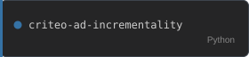
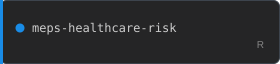
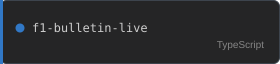
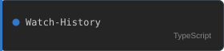

  

  

  
  

<h3 align="center">Projects</h3>

  
  
  
  
  
  
  
  
  

  
    Live &nbsp;·&nbsp;
    <a href="https://f1bulletin.pournamiprakash.dev">f1bulletin</a> &nbsp;·&nbsp;
    <a href="https://ipl-bulletin.vercel.app">ipl-bulletin</a> &nbsp;·&nbsp;
    <a href="https://seen-next.vercel.app/">seen-next</a> &nbsp;·&nbsp;
    <a href="https://guilttrip.pournamiprakash.dev/">guilttrip</a> &nbsp;·&nbsp;
    <a href="https://blah.pournamiprakash.dev/">blah</a>
  

<h3 align="center">Tech Stack</h3>

  <!-- Programming Languages -->
  
  
  
  
  
  
  
  

  <!-- Data Science & ML -->
  
  
  
  
  
  
  
  
  

  <!-- Data Engineering & MLOps -->
  
  
  
  
  
  
  
  
  
  
  
  
  
  
  

  <!-- Data Visualization & BI -->
  
  
  
  
  
  
  

  <!-- Databases & Tools -->
  
  
  
  
  
  
  
  
  
  
  

